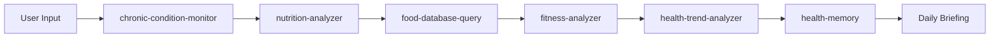

<div align="center">

# 🩺 VitaClaw

### 204 AI Health Skills for Claude Code

  

From blood pressure tracking to tumor board analysis — plug-and-play health intelligence for your AI assistant.

</div>

---

## What is VitaClaw?

VitaClaw is an open-source library of 204 modular health AI skills designed to run inside Claude Code. Each skill is a self-contained `SKILL.md` file that gives your AI assistant deep, domain-specific health capabilities — from daily vitals logging to clinical genomics interpretation.

VitaClaw is built on three pillars:

1. **Health Memory System** — Daily wellness tracking under `memory/health/` plus a structured clinical record archive under `~/.openclaw/patients/`. Your data lives as plain Markdown files on your machine, versioned by git, owned by you.
2. **Modular Skills** — 204 self-contained `SKILL.md` files, each defining its own prompt, tools, and data format. Drop in only what you need, edit freely, extend without limits.
3. **Scenario Orchestration** — 7 scenario apps (e.g., `diabetes-control-hub`, `hypertension-daily-copilot`) that chain multiple skills into end-to-end clinical workflows, from data capture through longitudinal analysis to care recommendations.

### Why VitaClaw?


| Feature        | Generic Health App     | VitaClaw                                |
| ---------------- | ------------------------ | ----------------------------------------- |
| Data ownership | Cloud / vendor lock-in | Local files — you own everything       |
| Customization  | Fixed features         | Edit any`SKILL.md`                      |
| Clinical depth | Consumer-grade         | Research-grade (PubMed, ClinVar, GWAS)  |
| Integration    | Siloed                 | Skills chain together via health-memory |
| AI model       | Single vendor          | Any model via OpenRouter / Claude Code  |

---

## Installation

```bash
git clone https://github.com//
```

No build step, no dependencies, no configuration wizard. Skills activate automatically when Claude Code detects them in your project's `skills/` directory.

---

## Skills Overview


| #  | Category                                                                 | Count | Highlights                                                                                    |
| ---- | -------------------------------------------------------------------------- | ------- | ----------------------------------------------------------------------------------------------- |
| 1  | [Health Memory & Infrastructure](#1-health-memory--infrastructure)       | 2     | `health-memory`, `medical-record-organizer` — unified data layer for all skills              |
| 2  | [Scenario Applications](#2-scenario-applications)                        | 7     | `diabetes-control-hub`, `hypertension-daily-copilot`, `mental-wellness-companion`             |
| 3  | [Daily Health Tracking](#3-daily-health-tracking)                        | 13    | `blood-pressure-tracker`, `sleep-analyzer`, `wearable-analysis-agent`, `weekly-health-digest` |
| 4  | [Mental Health & Crisis](#4-mental-health--crisis-intervention)          | 12    | `crisis-detection-intervention-ai`, `adhd-daily-planner`, `grief-companion`                   |
| 5  | [Chronic Disease & Treatment](#5-chronic-disease--treatment-management)  | 10    | `chemo-side-effect-tracker`, `medication-reminder`, `post-surgery-recovery`                   |
| 6  | [Biomedical Databases](#6-biomedical-databases)                          | 23    | `pubmed-database`, `clinvar-database`, `kegg-database`, `uniprot-database`                    |
| 7  | [Pharmacology & Drug Safety](#7-pharmacology--drug-safety)               | 9     | `drug-interaction-checker`, `drug-label-lookup`, `drugbank-database`                          |
| 8  | [Clinical Research & Trials](#8-clinical-research--trials)               | 7     | `trial-eligibility-agent`, `clinical-trial-protocol-skill`, `clinical-diagnostic-reasoning`   |
| 9  | [Genomics & Variant Interpretation](#9-genomics--variant-interpretation) | 14    | `variant-interpretation-acmg`, `gwas-lookup`, `gwas-prs`                                      |
| 10 | [Pharmacogenomics](#10-pharmacogenomics)                                 | 4     | `pharmgx-reporter`, `nutrigx_advisor`, `pharmacogenomics-agent`                               |
| 11 | [Oncology & Precision Medicine](#11-oncology--precision-medicine)        | 13    | `tumor-heterogeneity-agent`, `digital-twin-clinical-agent`, `hrd-analysis-agent`              |
| 12 | [Hematology & Blood Disorders](#12-hematology--blood-disorders)          | 8     | `chip-clonal-hematopoiesis-agent`, `mpn-progression-monitor-agent`, `myeloma-mrd-agent`       |
| 13 | [Immunoinformatics](#13-immunoinformatics)                               | 4     | `bio-immunoinformatics-neoantigen-prediction`, `bio-immunoinformatics-mhc-binding-prediction` |
| 14 | [Liquid Biopsy & ctDNA](#14-liquid-biopsy--ctdna)                        | 8     | `bio-ctdna-mutation-detection`, `mrd-edge-detection-agent`, `liquid-biopsy-analytics-agent`   |
| 15 | [ToolUniverse Suite](#15-tooluniverse-suite)                             | 27    | Comprehensive multi-tool research workflows spanning databases, analysis, and reporting       |
| 16 | [Medical NLP & Reports](#16-medical-nlp--reports)                        | 13    | `clinical-note-summarization`, `radgpt-radiology-reporter`, `checkup-report-interpreter`      |
| 17 | [Research & Literature](#17-research--literature)                        | 11    | `literature-review`, `deep-research`, `pubmed-search`, `knowledge-synthesis`                  |
| 18 | [Data Science & Visualization](#18-data-science--visualization)          | 4     | `statistical-analysis`, `data-visualization-biomedical`, `exploratory-data-analysis`          |
| 19 | [General Health & Lifestyle](#19-general-health--lifestyle)              | 11    | `tcm-constitution-analyzer`, `travel-health-analyzer`, `food-database-query`                  |
| 20 | [Utilities & Document Processing](#20-utilities--document-processing)    | 5     | `markitdown`, `pdf-processing-pro`, `medical-research-toolkit`                                |

**Total: 204 skills**

---

## Complete Skill Catalog

## 1. Health Memory & Infrastructure


| Skill                           | Description                                                                                                        |
| --------------------------------- | -------------------------------------------------------------------------------------------------------------------- |
| [health-memory](health-memory/) | Centralized health memory hub — manages daily logs and per-item longitudinal tracking files under memory/health/. |
| [medical-record-organizer](medical-record-organizer/) | Structured medical record archive — auto-classifies PDFs, scans, and lab reports into a per-patient directory (imaging, labs, pathology, genomics, discharge summaries). Builds navigable INDEX.md with one-line summaries. |

## 2. Scenario Applications


| Skill                                                             | Description                                                                                                                                                                                                    |
| ------------------------------------------------------------------- | ---------------------------------------------------------------------------------------------------------------------------------------------------------------------------------------------------------------- |
| [annual-checkup-advisor](annual-checkup-advisor/)                 | Orchestrates comprehensive annual checkup interpretation by coordinating report parsing, lab interpretation, family history analysis, genetic risk scoring, TCM constitution assessment, and guideline lookup. |
| [caffeine-sleep-advisor](caffeine-sleep-advisor/)                 | Analyzes the relationship between caffeine consumption and sleep quality by coordinating caffeine tracking, sleep analysis, and trend correlation.                                                             |
| [calorie-fitness-manager](calorie-fitness-manager/)               | Manages daily calorie balance and fitness tracking by coordinating BMR/TDEE calculation, nutrition analysis, food lookup, exercise stats, trend analysis, and SMART goal tracking.                             |
| [diabetes-control-hub](diabetes-control-hub/)                     | Manages comprehensive diabetes control by coordinating blood glucose tracking, nutrition analysis, exercise correlation, kidney function monitoring, and complication risk assessment.                         |
| [hypertension-daily-copilot](hypertension-daily-copilot/)         | Provides comprehensive daily hypertension management by coordinating blood pressure tracking, medication adherence, DASH diet scoring, exercise monitoring, and trend analysis.                                |
| [mental-wellness-companion](mental-wellness-companion/)           | Provides daily mental health support by coordinating PHQ-9/GAD-7 assessment, crisis detection, sleep-mood correlation, exercise prescription, and behavioral activation.                                       |
| [nutrition-supplement-optimizer](nutrition-supplement-optimizer/) | Evaluates dietary nutrition gaps and supplement safety by coordinating nutrition analysis, food alternatives, supplement interaction checks, adverse event screening, and effect tracking.                     |

## 3. Daily Health Tracking


| Skill                                                   | Description                                                                                                                                                                                                                                                                            |
| --------------------------------------------------------- | ---------------------------------------------------------------------------------------------------------------------------------------------------------------------------------------------------------------------------------------------------------------------------------------- |
| [blood-pressure-tracker](blood-pressure-tracker/)       | Records and classifies blood pressure readings per ACC/AHA 2017 guidelines, detects morning surge, analyzes diurnal variation, and generates monthly statistics.                                                                                                                       |
| [caffeine-tracker](caffeine-tracker/)                   | Tracks daily caffeine intake from beverages, models residual caffeine using half-life decay (t½=5h).                                                                                                                                                                                  |
| [chronic-condition-monitor](chronic-condition-monitor/) | Monitors multiple chronic disease indicators (BP, glucose, HbA1c, lipids, uric acid, creatinine, eGFR, liver function) against Chinese clinical guidelines.                                                                                                                            |
| [fitness-analyzer](fitness-analyzer/)                   | Analyzes exercise data, identifies workout patterns, assesses fitness progress, and provides personalized training recommendations. Supports correlation with chronic disease data.                                                                                                    |
| [health-trend-analyzer](health-trend-analyzer/)         | Analyzes health data trends and patterns over time. Correlates medications, symptoms, vital signs, lab results, and other health indicators. Identifies concerning trends, improvements, and provides data-driven insights. Supports interactive HTML visualization reports (ECharts). |
| [kidney-function-tracker](kidney-function-tracker/)     | Tracks kidney function using CKD-EPI 2021 (race-free) eGFR formula, stages CKD G1-G5, monitors albuminuria categories A1-A3, and calculates eGFR decline rate.                                                                                                                         |
| [nutrition-analyzer](nutrition-analyzer/)               | Analyzes nutrition data, identifies dietary patterns, assesses nutritional status, and provides personalized nutrition advice. Supports correlation with exercise, sleep, and chronic disease data.                                                                                    |
| [sleep-analyzer](sleep-analyzer/)                       | Analyzes sleep data to compute efficiency, quality score (0-100), and stage distribution.                                                                                                                                                                                              |
| [tumor-marker-trend](tumor-marker-trend/)               | Tumor marker trending — records CEA/CA199/AFP and other markers, supports trend analysis, spike detection, and multi-marker comparison.                                                                                                                                               |
| [tumor-journey-summary](tumor-journey-summary/)         | Tumor journey timeline summary (based on patient directory structure + LLM extraction).                                                                                                                                                                                                |
| [wearable-analysis-agent](wearable-analysis-agent/)     | Analyzes longitudinal wearable sensor data (heart rate, activity, sleep) to detect anomalies and provide personalized health insights.                                                                                                                                                 |
| [weekly-health-digest](weekly-health-digest/)           | Aggregates the past 7 days of health data from health-memory into a narrative weekly report with a composite health score (0-100), per-domain summaries, cross-domain correlations, and actionable next-week suggestions.                                                              |
| [weightloss-analyzer](weightloss-analyzer/)             | Analyzes weight loss data, calculates metabolic rate, tracks energy deficit, manages weight loss phases.                                                                                                                                                                               |

## 4. Mental Health & Crisis Intervention


| Skill                                                                 | Description                                                                                                                                                                                                    |
| ----------------------------------------------------------------------- | ---------------------------------------------------------------------------------------------------------------------------------------------------------------------------------------------------------------- |
| [adhd-daily-planner](adhd-daily-planner/)                             | Time-blind friendly planning, executive function support, and daily structure for ADHD brains. Specializes in realistic time estimation, dopamine-aware task design, and building systems.                     |
| [crisis-detection-intervention-ai](crisis-detection-intervention-ai/) | Detect crisis signals in user content using NLP, mental health sentiment analysis, and safe intervention protocols. Implements suicide ideation detection, automated escalation, and crisis resource routing.  |
| [crisis-response-protocol](crisis-response-protocol/)                 | Handle mental health crisis situations in AI coaching safely. Implements crisis detection, safety protocols, emergency escalation, and suicide prevention features.                                            |
| [grief-companion](grief-companion/)                                   | Compassionate bereavement support, memorial creation, grief education, and healing journey guidance. Specializes in understanding grief stages, creating meaningful tributes, and supporting healing.          |
| [hrv-alexithymia-expert](hrv-alexithymia-expert/)                     | Heart rate variability biometrics and emotional awareness training.                                                                                                                                            |
| [jungian-psychologist](jungian-psychologist/)                         | Expert in Jungian analytical psychology, depth psychology, shadow work, archetypal analysis, dream interpretation, active imagination, addiction/recovery through Jungian lens, and the individuation process. |
| [mental-health-analyzer](mental-health-analyzer/)                     | Analyzes mental health data, identifies psychological patterns, assesses mental health status, and provides personalized mental health advice. Supports correlation with sleep, exercise, and nutrition data.  |
| [modern-drug-rehab-computer](modern-drug-rehab-computer/)             | Comprehensive knowledge system for addiction recovery environments, supporting both residential and outpatient (IOP/PHP) patients. Expert in evidence-based treatment modalities (CBT, DBT, MI).               |
| [psychologist-analyst](psychologist-analyst/)                         | Psychological analysis and counseling support.                                                                                                                                                                 |
| [recovery-community-moderator](recovery-community-moderator/)         | Trauma-informed AI moderator for addiction recovery communities. Applies harm reduction principles, honors 12-step traditions, distinguishes healthy conflict from abuse, detects crisis posts.                |
| [speech-pathology-ai](speech-pathology-ai/)                           | Expert speech-language pathologist specializing in AI-powered speech therapy, phoneme analysis, articulation visualization, voice disorders, fluency intervention, and assistive communication.                |
| [occupational-health-analyzer](occupational-health-analyzer/)         | Analyzes occupational health data, identifies work-related health risks, assesses occupational health status, and provides personalized occupational health advice.                                            |

## 5. Chronic Disease & Treatment Management


| Skill                                                   | Description                                                                                                                                                                                           |
| --------------------------------------------------------- | ------------------------------------------------------------------------------------------------------------------------------------------------------------------------------------------------------- |
| [cancer-nutrition-coach](cancer-nutrition-coach/)       | Cancer patient nutrition assessment and diet plan generation (NRS-2002 scoring + LLM nutrition advice).                                                                                               |
| [chemo-side-effect-tracker](chemo-side-effect-tracker/) | Chemotherapy side effect tracking — records side effects per CTCAE v5.0 grading, supports cycle comparison, toxicity trend analysis, and comprehensive toxicity reports.                             |
| [emergency-card](emergency-card/)                       | Generates emergency medical information summary cards for quick access. Extracts key information (allergies, medications, emergencies, implants), supports multi-format output (JSON, text, QR code). |
| [family-health-analyzer](family-health-analyzer/)       | Analyzes family medical history, assesses genetic risk, identifies family health patterns, and provides personalized prevention advice.                                                               |
| [follow-up-reminder](follow-up-reminder/)               | Follow-up reminder management tool — supports disease-specific follow-up items, periodic reminders, and completion tracking.                                                                         |
| [goal-analyzer](goal-analyzer/)                         | Analyzes health goal data, identifies goal patterns, assesses goal progress, and provides personalized goal management advice.                                                                        |
| [medication-reminder](medication-reminder/)             | Manages medication schedules, tracks adherence (doses taken vs. prescribed).                                                                                                                          |
| [post-surgery-recovery](post-surgery-recovery/)         | Post-surgery recovery tracking — records drainage, wound status, pain, activity, and dietary recovery; supports milestone checks and follow-up reminders.                                            |
| [rehabilitation-analyzer](rehabilitation-analyzer/)     | Analyzes rehabilitation training data, identifies recovery patterns, assesses rehabilitation progress, and provides personalized recovery advice.                                                     |
| [supplement-manager](supplement-manager/)               | Supplement management — manages daily supplement regimens, tracks intake records and adherence, RxNorm interaction checks, and intelligent timing advice.                                            |

## 6. Biomedical Databases


| Skill                                               | Description                                                                                                                                                                       |
| ----------------------------------------------------- | ----------------------------------------------------------------------------------------------------------------------------------------------------------------------------------- |
| [biorxiv-database](biorxiv-database/)               | Efficient database search tool for bioRxiv preprint server.                                                                                                                       |
| [cbioportal-database](cbioportal-database/)         | Query cBioPortal for cancer genomics data including somatic mutations, copy number alterations, gene expression, and survival data across hundreds of cancer studies.             |
| [clinicaltrials-database](clinicaltrials-database/) | Query ClinicalTrials.gov via API v2. Search trials by condition, drug, location, status, or phase. Retrieve trial details by NCT ID for clinical research and patient matching.   |
| [clinpgx-database](clinpgx-database/)               | Access ClinPGx pharmacogenomics data (successor to PharmGKB). Query gene-drug interactions, CPIC guidelines, allele functions, for precision medicine and genotype-guided dosing. |
| [clinvar-database](clinvar-database/)               | Query NCBI ClinVar for variant clinical significance. Search by gene/position, interpret pathogenicity classifications, access via E-utilities API or FTP, annotate VCFs.         |
| [cosmic-database](cosmic-database/)                 | Access COSMIC cancer mutation database. Query somatic mutations, Cancer Gene Census, mutational signatures, gene fusions. Requires authentication.                                |
| [ensembl-database](ensembl-database/)               | Query Ensembl genome database REST API for 250+ species. Gene lookups, sequence retrieval, variant analysis, comparative genomics, orthologs, VEP predictions.                    |
| [fda-database](fda-database/)                       | Query openFDA API for drugs, devices, adverse events, recalls, regulatory submissions (510k, PMA), substance identification (UNII).                                               |
| [gene-database](gene-database/)                     | Query NCBI Gene via E-utilities/Datasets API. Search by symbol/ID, retrieve gene info (RefSeqs, GO, locations, phenotypes), batch lookups.                                        |
| [geo-database](geo-database/)                       | Access NCBI GEO for gene expression/genomics data. Search/download microarray and RNA-seq datasets (GSE, GSM, GPL), retrieve SOFT/Matrix files.                                   |
| [gnomad-database](gnomad-database/)                 | Query gnomAD for population allele frequencies, variant constraint scores (pLI, LOEUF), and loss-of-function intolerance.                                                         |
| [gwas-database](gwas-database/)                     | Query NHGRI-EBI GWAS Catalog for SNP-trait associations. Search variants by rs ID, disease/trait, gene, retrieve p-values and summary statistics.                                 |
| [hmdb-database](hmdb-database/)                     | Access Human Metabolome Database (220K+ metabolites). Search by name/ID/structure, retrieve chemical properties, biomarker data, NMR/MS spectra, pathways.                        |
| [interpro-database](interpro-database/)             | Query InterPro for protein family, domain, and functional site annotations.                                                                                                       |
| [kegg-database](kegg-database/)                     | Direct REST API access to KEGG (academic use only).                                                                                                                               |
| [monarch-database](monarch-database/)               | Query the Monarch Initiative knowledge graph for disease-gene-phenotype associations across species.                                                                              |
| [openalex-database](openalex-database/)             | Query and analyze scholarly literature using the OpenAlex database.                                                                                                               |
| [opentargets-database](opentargets-database/)       | Query Open Targets Platform for target-disease associations, drug target discovery, tractability/safety data, genetics/omics evidence, known drugs.                               |
| [pubchem-database](pubchem-database/)               | Query PubChem via PUG-REST API/PubChemPy (110M+ compounds). Search by name/CID/SMILES, retrieve properties, similarity/substructure searches, bioactivity.                        |
| [pubmed-database](pubmed-database/)                 | Direct REST API access to PubMed. Advanced Boolean/MeSH queries, E-utilities API, batch processing, citation management.                                                          |
| [reactome-database](reactome-database/)             | Query Reactome REST API for pathway analysis, enrichment, gene-pathway mapping, disease pathways, molecular interactions, expression analysis.                                    |
| [string-database](string-database/)                 | Query STRING API for protein-protein interactions (59M proteins, 20B interactions). Network analysis, GO/KEGG enrichment, interaction discovery, 5000+ species.                   |
| [uniprot-database](uniprot-database/)               | Direct REST API access to UniProt. Protein searches, FASTA retrieval, ID mapping, Swiss-Prot/TrEMBL.                                                                              |

## 7. Pharmacology & Drug Safety


| Skill                                                 | Description                                                                                                                                                             |
| ------------------------------------------------------- | ------------------------------------------------------------------------------------------------------------------------------------------------------------------------- |
| [drug-adverse-event-query](drug-adverse-event-query/) | Query drug adverse reaction reports via openFDA FAERS API (frequency, severity, outcomes).                                                                              |
| [drug-discovery-search](drug-discovery-search/)       | End-to-end drug discovery platform combining ChEMBL compounds, DrugBank, targets, and FDA labels. Natural language powered by Valyu.                                    |
| [drug-interaction-checker](drug-interaction-checker/) | Check drug-drug interactions (based on RxNorm API + FDA label supplement).                                                                                              |
| [drug-label-lookup](drug-label-lookup/)               | Query drug labels via openFDA API (indications, dosage, warnings, contraindications, adverse reactions, drug interactions).                                             |
| [drug-labels-search](drug-labels-search/)             | Search FDA drug labels with natural language queries. Official drug information, indications, and safety data via Valyu.                                                |
| [drug-name-resolver](drug-name-resolver/)             | Standardize drug names (generic/brand/development codes) to RxNorm RxCUI and retrieve drug classification information.                                                  |
| [drug-photo](drug-photo/)                             | Medication photo to personalized PGx dosage card via Claude vision — snap a pill, get genotype-informed guidance.                                                      |
| [drugbank-database](drugbank-database/)               | Access and analyze comprehensive drug information from DrugBank including drug properties, interactions, targets, pathways, chemical structures, and pharmacology data. |
| [drugbank-search](drugbank-search/)                   | Search DrugBank comprehensive drug database with natural language queries. Drug mechanisms, interactions, and safety data powered by Valyu.                             |

## 8. Clinical Research & Trials


| Skill                                                           | Description                                                                                                                                                                                                                                                              |
| ----------------------------------------------------------------- | -------------------------------------------------------------------------------------------------------------------------------------------------------------------------------------------------------------------------------------------------------------------------- |
| [clinical-decision-support](clinical-decision-support/)         | Generate professional clinical decision support (CDS) documents for pharmaceutical and clinical research settings, including patient cohort analyses and treatment recommendation reports. Supports GRADE evidence grading, statistical analysis, biomarker integration. |
| [clinical-diagnostic-reasoning](clinical-diagnostic-reasoning/) | Identify and counteract cognitive biases in medical decision-making through systematic error analysis and contextual algorithm application.                                                                                                                              |
| [clinical-trial-protocol-skill](clinical-trial-protocol-skill/) | Generate clinical trial protocols for medical devices or drugs.                                                                                                                                                                                                          |
| [clinical-trial-search](clinical-trial-search/)                 | Search ClinicalTrials.gov clinical trials, supports multi-dimensional filtering by disease, intervention, region, trial status.                                                                                                                                          |
| [clinical-trials-search](clinical-trials-search/)               | Search ClinicalTrials.gov with natural language queries. Find clinical trials, enrollment, and outcomes using Valyu semantic search.                                                                                                                                     |
| [trial-eligibility-agent](trial-eligibility-agent/)             | Parse trial protocols and patient data to produce criterion-level MET/NOT/UNKNOWN determinations with evidence and gaps for clinical trial screening.                                                                                                                    |
| [trialgpt-matching](trialgpt-matching/)                         | Trial shortlist — AI-driven patient-to-trial matching.                                                                                                                                                                                                                  |

## 9. Genomics & Variant Interpretation


| Skill                                                                                             | Description                                                                                                                                          |
| --------------------------------------------------------------------------------------------------- | ------------------------------------------------------------------------------------------------------------------------------------------------------ |
| [bio-clinical-databases-clinvar-lookup](bio-clinical-databases-clinvar-lookup/)                   | Query ClinVar for variant pathogenicity classifications, review status, and disease associations via REST API or local VCF.                          |
| [bio-clinical-databases-dbsnp-queries](bio-clinical-databases-dbsnp-queries/)                     | Query dbSNP for rsID lookups, variant annotations, and cross-references to other databases.                                                          |
| [bio-clinical-databases-gnomad-frequencies](bio-clinical-databases-gnomad-frequencies/)           | Query gnomAD for population allele frequencies to assess variant rarity.                                                                             |
| [bio-clinical-databases-hla-typing](bio-clinical-databases-hla-typing/)                           | Call HLA alleles from NGS data using OptiType, HLA-HD, or arcasHLA for immunogenomics applications.                                                  |
| [bio-clinical-databases-myvariant-queries](bio-clinical-databases-myvariant-queries/)             | Query myvariant.info API for aggregated variant annotations from multiple databases (ClinVar, gnomAD, dbSNP, COSMIC, etc.).                          |
| [bio-clinical-databases-polygenic-risk](bio-clinical-databases-polygenic-risk/)                   | Calculate polygenic risk scores using PRSice-2, LDpred2, or PRS-CS from GWAS summary statistics.                                                     |
| [bio-clinical-databases-somatic-signatures](bio-clinical-databases-somatic-signatures/)           | Extract and analyze mutational signatures from somatic variants using SigProfiler or MutationalPatterns.                                             |
| [bio-clinical-databases-tumor-mutational-burden](bio-clinical-databases-tumor-mutational-burden/) | Calculate tumor mutational burden from panel or WES data with proper normalization and clinical thresholds.                                          |
| [bio-clinical-databases-variant-prioritization](bio-clinical-databases-variant-prioritization/)   | Filter and prioritize variants by pathogenicity, population frequency, and clinical evidence for rare disease analysis.                              |
| [gwas-lookup](gwas-lookup/)                                                                       | Federated variant lookup across 9 genomic databases — GWAS Catalog, Open Targets, PheWeb (UKB, FinnGen, BBJ), GTEx, eQTL Catalogue.                 |
| [gwas-prs](gwas-prs/)                                                                             | Calculate polygenic risk scores from DTC genetic data using the PGS Catalog.                                                                         |
| [multi-ancestry-prs-agent](multi-ancestry-prs-agent/)                                             | AI-powered multi-ancestry polygenic risk score calculation and optimization for equitable disease risk prediction across diverse global populations. |
| [variant-interpretation-acmg](variant-interpretation-acmg/)                                       | Classifies genetic variants according to ACMG (American College of Medical Genetics) guidelines.                                                     |
| [varcadd-pathogenicity](varcadd-pathogenicity/)                                                   | Variant pathogenicity scoring using CADD and other computational predictors.                                                                         |

## 10. Pharmacogenomics


| Skill                                                                               | Description                                                                                                                                                                   |
| ------------------------------------------------------------------------------------- | ------------------------------------------------------------------------------------------------------------------------------------------------------------------------------- |
| [bio-clinical-databases-pharmacogenomics](bio-clinical-databases-pharmacogenomics/) | Query PharmGKB and CPIC for drug-gene interactions, pharmacogenomic annotations, and dosing guidelines.                                                                       |
| [nutrigx_advisor](nutrigx_advisor/)                                                 | Generates personalized nutrition reports from consumer genetic data (23andMe, AncestryDNA). Translates nutritionally-relevant SNPs into dietary and supplementation guidance. |
| [pharmacogenomics-agent](pharmacogenomics-agent/)                                   | AI-driven pharmacogenomic analysis for precision dosing and adverse event prediction using multi-omics data.                                                                  |
| [pharmgx-reporter](pharmgx-reporter/)                                               | Pharmacogenomic report from DTC genetic data (23andMe/AncestryDNA) — 12 genes, 31 SNPs, 51 drugs.                                                                            |

## 11. Oncology & Precision Medicine


| Skill                                                                       | Description                                                                                                                                                                        |
| ----------------------------------------------------------------------------- | ------------------------------------------------------------------------------------------------------------------------------------------------------------------------------------ |
| [autonomous-oncology-agent](autonomous-oncology-agent/)                     | Precision oncology research and treatment recommendation.                                                                                                                          |
| [cancer-metabolism-agent](cancer-metabolism-agent/)                         | AI-powered analysis of cancer metabolic reprogramming including Warburg effect, glutamine addiction, lipid metabolism, and metabolic vulnerabilities for therapeutic targeting.    |
| [cellular-senescence-agent](cellular-senescence-agent/)                     | AI-powered analysis of cellular senescence for aging research, cancer therapy response, and senolytic drug development.                                                            |
| [chromosomal-instability-agent](chromosomal-instability-agent/)             | AI-powered analysis of chromosomal instability (CIN) signatures for cancer prognosis, immunotherapy response prediction, and therapeutic vulnerability identification.             |
| [digital-twin-clinical-agent](digital-twin-clinical-agent/)                 | AI-powered patient digital twin creation for clinical trial simulation, treatment outcome prediction, and personalized medicine using real-world data and multi-omics integration. |
| [hrd-analysis-agent](hrd-analysis-agent/)                                   | AI-powered homologous recombination deficiency (HRD) analysis for PARP inhibitor response prediction using genomic scarring signatures and BRCA pathway assessment.                |
| [immune-checkpoint-combination-agent](immune-checkpoint-combination-agent/) | AI-powered analysis for predicting optimal immune checkpoint inhibitor combinations based on tumor microenvironment, biomarkers, and molecular profiling.                          |
| [microbiome-cancer-agent](microbiome-cancer-agent/)                         | AI-powered analysis of microbiome-cancer interactions including tumor microbiome profiling, immunotherapy response prediction, and microbiome-targeted therapeutic opportunities.  |
| [nk-cell-therapy-agent](nk-cell-therapy-agent/)                             | AI-powered NK cell therapy design for cancer immunotherapy including CAR-NK engineering, memory-like NK generation, and KIR/HLA matching optimization.                             |
| [precision-oncology-agent](precision-oncology-agent/)                       | Fuse genomic variants, pathology findings, and clinical context to draft evidence-linked therapy options for tumor board review.                                                   |
| [tumor-clonal-evolution-agent](tumor-clonal-evolution-agent/)               | AI-powered analysis of tumor clonal architecture, subclonal dynamics, and evolutionary trajectories from multi-region sequencing and longitudinal liquid biopsy data.              |
| [tumor-heterogeneity-agent](tumor-heterogeneity-agent/)                     | AI-powered intratumor heterogeneity analysis for clonal architecture reconstruction, subclonal evolution tracking, and therapy resistance prediction.                              |
| [tumor-mutational-burden-agent](tumor-mutational-burden-agent/)             | Calculates and harmonizes Tumor Mutational Burden (TMB) across platforms to predict immunotherapy response.                                                                        |

## 12. Hematology & Blood Disorders


| Skill                                                               | Description                                                                                                                                                                         |
| --------------------------------------------------------------------- | ------------------------------------------------------------------------------------------------------------------------------------------------------------------------------------- |
| [bone-marrow-ai-agent](bone-marrow-ai-agent/)                       | AI-powered bone marrow morphology analysis, cell classification, and hematologic disorder diagnosis using deep learning on aspirate and biopsy images.                              |
| [chip-clonal-hematopoiesis-agent](chip-clonal-hematopoiesis-agent/) | AI-powered clonal hematopoiesis of indeterminate potential (CHIP) detection, risk stratification, and cardiovascular/malignancy risk prediction.                                    |
| [coagulation-thrombosis-agent](coagulation-thrombosis-agent/)       | AI-powered analysis of coagulation disorders, thrombosis risk prediction, anticoagulation management, and platelet function assessment.                                             |
| [cytokine-storm-analysis-agent](cytokine-storm-analysis-agent/)     | AI-powered cytokine release syndrome (CRS) and cytokine storm analysis for prediction, monitoring, and management in immunotherapy and infectious disease.                          |
| [hemoglobinopathy-analysis-agent](hemoglobinopathy-analysis-agent/) | AI-powered analysis of hemoglobin disorders including sickle cell disease, thalassemias, and variant hemoglobins using HPLC, electrophoresis, and molecular data.                   |
| [mpn-progression-monitor-agent](mpn-progression-monitor-agent/)     | AI-powered myeloproliferative neoplasm monitoring for disease progression prediction, treatment response tracking, and transformation risk assessment in PV, ET, and myelofibrosis. |
| [mpn-research-assistant](mpn-research-assistant/)                   | Myeloproliferative neoplasm (MPN) research expertise including JAK2/CALR/MPL mutations, myelofibrosis, polycythemia vera, essential thrombocythemia.                                |
| [myeloma-mrd-agent](myeloma-mrd-agent/)                             | AI-powered minimal residual disease (MRD) analysis for multiple myeloma using next-generation flow cytometry, NGS, and mass spectrometry approaches.                                |

## 13. Immunoinformatics


| Skill                                                                                         | Description                                                                                                                                                      |
| ----------------------------------------------------------------------------------------------- | ------------------------------------------------------------------------------------------------------------------------------------------------------------------ |
| [bio-immunoinformatics-epitope-prediction](bio-immunoinformatics-epitope-prediction/)         | Predict B-cell and T-cell epitopes using BepiPred, IEDB tools, and structure-based methods for vaccine and antibody design.                                      |
| [bio-immunoinformatics-immunogenicity-scoring](bio-immunoinformatics-immunogenicity-scoring/) | Score and prioritize neoantigens and epitopes for immunogenicity using multi-factor models combining MHC binding, processing, expression, and sequence features. |
| [bio-immunoinformatics-mhc-binding-prediction](bio-immunoinformatics-mhc-binding-prediction/) | Predict peptide-MHC class I and II binding affinity using MHCflurry and NetMHCpan neural network models.                                                         |
| [bio-immunoinformatics-neoantigen-prediction](bio-immunoinformatics-neoantigen-prediction/)   | Identify tumor neoantigens from somatic mutations using pVACtools for personalized cancer immunotherapy.                                                         |

## 14. Liquid Biopsy & ctDNA


| Skill                                                               | Description                                                                                                                                                   |
| --------------------------------------------------------------------- | --------------------------------------------------------------------------------------------------------------------------------------------------------------- |
| [bio-ctdna-mutation-detection](bio-ctdna-mutation-detection/)       | Detects somatic mutations in circulating tumor DNA using variant callers optimized for low allele fractions with UMI-based error suppression.                 |
| [bio-liquid-biopsy-pipeline](bio-liquid-biopsy-pipeline/)           | Cell-free DNA analysis pipeline from plasma sequencing to tumor monitoring.                                                                                   |
| [bio-longitudinal-monitoring](bio-longitudinal-monitoring/)         | Tracks ctDNA dynamics over time for treatment response monitoring using serial liquid biopsy samples.                                                         |
| [bio-methylation-based-detection](bio-methylation-based-detection/) | Analyzes cfDNA methylation patterns for cancer detection using cfMeDIP-seq or bisulfite sequencing with MethylDackel.                                         |
| [bio-tumor-fraction-estimation](bio-tumor-fraction-estimation/)     | Estimates circulating tumor DNA fraction from shallow whole-genome sequencing using ichorCNA.                                                                 |
| [ctdna-dynamics-mrd-agent](ctdna-dynamics-mrd-agent/)               | AI-powered circulating tumor DNA dynamics analysis for molecular residual disease detection, treatment response monitoring, and early relapse prediction.     |
| [liquid-biopsy-analytics-agent](liquid-biopsy-analytics-agent/)     | Comprehensive analysis of liquid biopsy data (ctDNA, CTCs) for cancer detection, MRD monitoring, and response tracking.                                       |
| [mrd-edge-detection-agent](mrd-edge-detection-agent/)               | Ultra-sensitive AI-powered molecular residual disease detection using MRD-EDGE deep learning for sub-0.001% VAF ctDNA detection and early relapse prediction. |

## 15. ToolUniverse Suite


| Skill                                                                                             | Description                                                                                                                                           |
| --------------------------------------------------------------------------------------------------- | ------------------------------------------------------------------------------------------------------------------------------------------------------- |
| [tooluniverse-adverse-event-detection](tooluniverse-adverse-event-detection/)                     | Detect and analyze adverse drug event signals using FDA FAERS data, drug labels, disproportionality analysis (PRR, ROR, IC), and biomedical evidence. |
| [tooluniverse-cancer-variant-interpretation](tooluniverse-cancer-variant-interpretation/)         | Provide comprehensive clinical interpretation of somatic mutations in cancer.                                                                         |
| [tooluniverse-clinical-guidelines](tooluniverse-clinical-guidelines/)                             | Search and retrieve clinical practice guidelines across 12+ authoritative sources including NICE, WHO, ADA, AHA/ACC, NCCN, SIGN, CPIC.                |
| [tooluniverse-clinical-trial-design](tooluniverse-clinical-trial-design/)                         | Strategic clinical trial design feasibility assessment using ToolUniverse.                                                                            |
| [tooluniverse-clinical-trial-matching](tooluniverse-clinical-trial-matching/)                     | AI-driven patient-to-trial matching for precision medicine and oncology.                                                                              |
| [tooluniverse-disease-research](tooluniverse-disease-research/)                                   | Generate comprehensive disease research reports using 100+ ToolUniverse tools.                                                                        |
| [tooluniverse-drug-drug-interaction](tooluniverse-drug-drug-interaction/)                         | Comprehensive drug-drug interaction (DDI) prediction and risk assessment.                                                                             |
| [tooluniverse-drug-repurposing](tooluniverse-drug-repurposing/)                                   | Identify drug repurposing candidates using ToolUniverse for target-based, compound-based, and disease-driven strategies.                              |
| [tooluniverse-drug-research](tooluniverse-drug-research/)                                         | Generates comprehensive drug research reports with compound disambiguation, evidence grading, and mandatory completeness sections.                    |
| [tooluniverse-drug-target-validation](tooluniverse-drug-target-validation/)                       | Comprehensive computational validation of drug targets for early-stage drug discovery.                                                                |
| [tooluniverse-gwas-drug-discovery](tooluniverse-gwas-drug-discovery/)                             | Transform GWAS signals into actionable drug targets and repurposing opportunities.                                                                    |
| [tooluniverse-gwas-finemapping](tooluniverse-gwas-finemapping/)                                   | Identify and prioritize causal variants at GWAS loci using statistical fine-mapping and locus-to-gene predictions.                                    |
| [tooluniverse-gwas-snp-interpretation](tooluniverse-gwas-snp-interpretation/)                     | Interpret genetic variants (SNPs) from GWAS studies by aggregating evidence from multiple databases.                                                  |
| [tooluniverse-gwas-study-explorer](tooluniverse-gwas-study-explorer/)                             | Compare GWAS studies, perform meta-analyses, and assess replication across cohorts.                                                                   |
| [tooluniverse-gwas-trait-to-gene](tooluniverse-gwas-trait-to-gene/)                               | Discover genes associated with diseases and traits using GWAS data from the GWAS Catalog (500,000+ associations) and Open Targets Genetics.           |
| [tooluniverse-immune-repertoire-analysis](tooluniverse-immune-repertoire-analysis/)               | Comprehensive immune repertoire analysis for T-cell and B-cell receptor sequencing data.                                                              |
| [tooluniverse-immunotherapy-response-prediction](tooluniverse-immunotherapy-response-prediction/) | Predict patient response to immune checkpoint inhibitors (ICIs) using multi-biomarker integration.                                                    |
| [tooluniverse-infectious-disease](tooluniverse-infectious-disease/)                               | Rapid pathogen characterization and drug repurposing analysis for infectious disease outbreaks.                                                       |
| [tooluniverse-literature-deep-research](tooluniverse-literature-deep-research/)                   | Conduct comprehensive literature research with target disambiguation, evidence grading, and structured theme extraction.                              |
| [tooluniverse-network-pharmacology](tooluniverse-network-pharmacology/)                           | Construct and analyze compound-target-disease networks for drug repurposing, polypharmacology discovery, and systems pharmacology.                    |
| [tooluniverse-pharmacovigilance](tooluniverse-pharmacovigilance/)                                 | Analyze drug safety signals from FDA adverse event reports, label warnings, and pharmacogenomic data.                                                 |
| [tooluniverse-polygenic-risk-score](tooluniverse-polygenic-risk-score/)                           | Build and interpret polygenic risk scores (PRS) for complex diseases using GWAS summary statistics.                                                   |
| [tooluniverse-precision-medicine-stratification](tooluniverse-precision-medicine-stratification/) | Comprehensive patient stratification for precision medicine by integrating genomic, clinical, and therapeutic data.                                   |
| [tooluniverse-precision-oncology](tooluniverse-precision-oncology/)                               | Provide actionable treatment recommendations for cancer patients based on molecular profile.                                                          |
| [tooluniverse-rare-disease-diagnosis](tooluniverse-rare-disease-diagnosis/)                       | Provide differential diagnosis for patients with suspected rare diseases based on phenotype and genetic data.                                         |
| [tooluniverse-variant-analysis](tooluniverse-variant-analysis/)                                   | Production-ready VCF processing, variant annotation, mutation analysis, and structural variant (SV/CNV) interpretation.                               |
| [tooluniverse-variant-interpretation](tooluniverse-variant-interpretation/)                       | Systematic clinical variant interpretation from raw variant calls to ACMG-classified recommendations with structural impact analysis.                 |

## 16. Medical NLP & Reports


| Skill                                                       | Description                                                                                                                                                                                     |
| ------------------------------------------------------------- | ------------------------------------------------------------------------------------------------------------------------------------------------------------------------------------------------- |
| [chatehr-clinician-assistant](chatehr-clinician-assistant/) | EHR Chat Assistant for clinical workflows.                                                                                                                                                      |
| [checkup-report-interpreter](checkup-report-interpreter/)   | Health checkup report intelligent interpretation (PDF parsing + LLM abnormality identification and health advice).                                                                              |
| [clinical-nlp-extractor](clinical-nlp-extractor/)           | Extracts medical entities (Diseases, Medications, Procedures) from unstructured clinical text using regex, rules, or LLM wrappers.                                                              |
| [clinical-note-summarization](clinical-note-summarization/) | Structure raw clinical notes into SOAP-format summaries with explicit contradictions, missing data, and ICD-linked assessments.                                                                 |
| [clinical-reports](clinical-reports/)                       | Write comprehensive clinical reports including case reports (CARE guidelines), diagnostic reports, clinical trial reports (ICH-E3), and patient documentation (SOAP, H&P, discharge summaries). |
| [lab-results](lab-results/)                                 | Lab results interpretation and tracking for healthcare workflows.                                                                                                                               |
| [medical-entity-extractor](medical-entity-extractor/)       | Extract medical entities (symptoms, medications, lab values, diagnoses) from patient messages.                                                                                                  |
| [medical-imaging-review](medical-imaging-review/)           | Medical imaging review and analysis.                                                                                                                                                            |
| [multimodal-medical-imaging](multimodal-medical-imaging/)   | Analyzes medical images (X-ray, MRI, CT) using multimodal LLMs to identify anomalies and generate reports.                                                                                      |
| [patiently-ai](patiently-ai/)                               | Simplifies medical documents for patients.                                                                                                                                                      |
| [prior-auth-review-skill](prior-auth-review-skill/)         | Automate payer review of prior authorization (PA) requests.                                                                                                                                     |
| [radgpt-radiology-reporter](radgpt-radiology-reporter/)     | Radiology report generation and interpretation.                                                                                                                                                 |
| [treatment-plans](treatment-plans/)                         | Generate concise, focused medical treatment plans in LaTeX/PDF format for all clinical specialties.                                                                                             |

## 17. Research & Literature


| Skill                                               | Description                                                                                                                                          |
| ----------------------------------------------------- | ------------------------------------------------------------------------------------------------------------------------------------------------------ |
| [biomedical-search](biomedical-search/)             | Complete biomedical information search combining PubMed, preprints, clinical trials, and FDA drug labels. Powered by Valyu semantic search.          |
| [citation-management](citation-management/)         | Comprehensive citation management for academic research.                                                                                             |
| [deep-research](deep-research/)                     | Execute autonomous multi-step deep research on any topic.                                                                                            |
| [knowledge-synthesis](knowledge-synthesis/)         | Combines search results from multiple sources into coherent, deduplicated answers with source attribution.                                           |
| [leads-literature-mining](leads-literature-mining/) | Automated literature review and mining.                                                                                                              |
| [literature-review](literature-review/)             | Conduct comprehensive, systematic literature reviews using multiple academic databases (PubMed, arXiv, bioRxiv, Semantic Scholar, etc.).             |
| [literature-search](literature-search/)             | Comprehensive scientific literature search across PubMed, arXiv, bioRxiv, medRxiv. Natural language queries powered by Valyu semantic search.        |
| [medrxiv-search](medrxiv-search/)                   | Search medRxiv medical preprints with natural language queries. Powered by Valyu semantic search.                                                    |
| [pubmed-abstract-reader](pubmed-abstract-reader/)   | Batch retrieve PubMed article abstracts, authors, journal details via PMID.                                                                          |
| [pubmed-search](pubmed-search/)                     | Intelligent PubMed literature search: 3-layer LLM progressive query + evidence bucketing + stratified sampling for high-quality clinical literature. |
| [research-lookup](research-lookup/)                 | Look up current research information using Perplexity's Sonar Pro Search or Sonar Reasoning Pro models through OpenRouter.                           |

## 18. Data Science & Visualization


| Skill                                                           | Description                                                                                                                                                            |
| ----------------------------------------------------------------- | ------------------------------------------------------------------------------------------------------------------------------------------------------------------------ |
| [data-stats-analysis](data-stats-analysis/)                     | Perform statistical tests, hypothesis testing, correlation analysis, and multiple testing corrections using scipy and statsmodels. Works with ANY LLM provider.        |
| [data-visualization-biomedical](data-visualization-biomedical/) | Publication-quality visualizations for biomedical and genomics data.                                                                                                   |
| [exploratory-data-analysis](exploratory-data-analysis/)         | Perform comprehensive exploratory data analysis on scientific data files across 200+ file formats.                                                                     |
| [statistical-analysis](statistical-analysis/)                   | Statistical analysis toolkit. Hypothesis tests (t-test, ANOVA, chi-square), regression, correlation, Bayesian stats, power analysis, assumption checks, APA reporting. |

## 19. General Health & Lifestyle


| Skill                                                   | Description                                                                                                                                                                                    |
| --------------------------------------------------------- | ------------------------------------------------------------------------------------------------------------------------------------------------------------------------------------------------ |
| [care-coordination](care-coordination/)                 | Care coordination agent for healthcare workflows.                                                                                                                                              |
| [claims-appeals](claims-appeals/)                       | Claims appeals agent for healthcare workflows.                                                                                                                                                 |
| [ehr-fhir-integration](ehr-fhir-integration/)           | Provides comprehensive tools for working with Electronic Health Records (EHR) using the HL7 FHIR standard.                                                                                     |
| [fhir-developer-skill](fhir-developer-skill/)           | FHIR development toolkit for healthcare interoperability.                                                                                                                                      |
| [food-database-query](food-database-query/)             | Comprehensive food nutrition database with search, comparison, recommendations, and automatic calorie calculation.                                                                             |
| [oral-health-analyzer](oral-health-analyzer/)           | Analyzes oral health data, identifies dental issues, assesses oral health status, and provides personalized oral health advice.                                                                |
| [sexual-health-analyzer](sexual-health-analyzer/)       | Comprehensive sexual health data analysis including IIEF-5 scoring, STD screening management, contraception assessment, and cross-domain correlation analysis.                                 |
| [skin-health-analyzer](skin-health-analyzer/)           | Analyzes skin health data, identifies skin issues, assesses skin health status, and provides personalized skin health advice.                                                                  |
| [sleep-optimizer](sleep-optimizer/)                     | Generates prioritized, personalized sleep improvement recommendations based on sleep metrics, caffeine data, screen time, and exercise timing.                                                 |
| [tcm-constitution-analyzer](tcm-constitution-analyzer/) | Analyzes TCM (Traditional Chinese Medicine) constitution data, identifies constitution types, assesses characteristics, and provides personalized wellness advice.                             |
| [travel-health-analyzer](travel-health-analyzer/)       | Analyzes travel health data, assesses destination health risks, provides vaccination recommendations, and generates multilingual emergency medical information cards. Integrates WHO/CDC data. |

## 20. Utilities & Document Processing


| Skill                                                 | Description                                                                                                                                                                             |
| ------------------------------------------------------- | ----------------------------------------------------------------------------------------------------------------------------------------------------------------------------------------- |
| [markitdown](markitdown/)                             | Convert files and office documents to Markdown. Supports PDF, DOCX, PPTX, XLSX, images (with OCR), audio (with transcription), HTML, CSV, JSON, XML, ZIP, YouTube URLs, EPubs and more. |
| [medical-research-toolkit](medical-research-toolkit/) | Query 14+ biomedical databases for drug repurposing, target discovery, clinical trials, and literature research.                                                                        |
| [pdf](pdf/)                                           | Use this skill for anything with PDF files.                                                                                                                                             |
| [pdf-processing](pdf-processing/)                     | Extract text and tables from PDF files, fill forms, merge documents.                                                                                                                    |
| [pdf-processing-pro](pdf-processing-pro/)             | Production-ready PDF processing with forms, tables, OCR, validation, and batch operations.                                                                                              |

---

## Scenario Applications

The 7 scenario skills orchestrate multiple sub-skills into complete clinical workflows, turning a single user prompt into a coordinated multi-agent health session.

The `diabetes-control-hub` scenario illustrates how sub-skills are chained end-to-end:




| Scenario                                                          | What It Coordinates                                                                                                                |
| ------------------------------------------------------------------- | ------------------------------------------------------------------------------------------------------------------------------------ |
| [annual-checkup-advisor](annual-checkup-advisor/)                 | Checkup report parsing, lab interpretation, longitudinal trend analysis, and personalized screening reminders.                     |
| [caffeine-sleep-advisor](caffeine-sleep-advisor/)                 | Caffeine intake tracking, sleep quality analysis, circadian rhythm optimization, and behavioral nudge generation.                  |
| [calorie-fitness-manager](calorie-fitness-manager/)               | Calorie logging, food database lookup, workout tracking, weight trend analysis, and goal-adjusted meal planning.                   |
| [diabetes-control-hub](diabetes-control-hub/)                     | Blood glucose monitoring, nutrition analysis, food database query, fitness tracking, trend analysis, and daily briefing synthesis. |
| [hypertension-daily-copilot](hypertension-daily-copilot/)         | Blood pressure logging, medication adherence tracking, sodium/diet assessment, stress correlation, and alert escalation.           |
| [mental-wellness-companion](mental-wellness-companion/)           | Mood journaling, sleep quality correlation, stress pattern detection, CBT-aligned suggestions, and weekly wellness summaries.      |
| [nutrition-supplement-optimizer](nutrition-supplement-optimizer/) | Dietary intake analysis, micronutrient gap detection, supplement interaction checking, and personalized stack recommendations.     |

---

## Health Memory System

All VitaClaw health skills share a unified memory layout under `memory/health/`:

```
memory/health/
├── _health-profile.md              # Long-term health baseline
├── daily/                           # Daily logs (one file per day)
│   └── YYYY-MM-DD.md
├── items/                           # Per-item longitudinal tracking
│   ├── blood-pressure.md
│   ├── blood-sugar.md
│   └── ...
└── files/                           # Health documents (PDFs, images)
```

- **Daily logs** aggregate multi-skill data into one file per day. Each skill writes its own `## Section [skill-name · HH:MM]` block.
- **Item files** maintain 90-day rolling histories for longitudinal metrics (blood pressure, weight, glucose, etc.) with trend summaries.
- **Format contract** — all skills follow the same Markdown schema with YAML frontmatter, so any skill can consume data produced by any other skill with no transformation needed.

### Medical Record Archive

For clinical documents — imaging reports, lab results, pathology, genomics, and discharge summaries — the [medical-record-organizer](medical-record-organizer/) skill provides a structured per-patient archive under `~/.openclaw/patients/`:

```
~/.openclaw/patients/[patient-id]/
├── INDEX.md                  # Navigation entry point
├── profile.json              # Structured patient info
├── timeline.md               # Chronological event table
├── 01_Current Status/
├── 02_Diagnosis & Staging/
├── 03_Molecular Pathology/   # Gene panels + IHC
├── 04_Imaging/               # CT / MRI / PET-CT
├── 05_Lab Results/           # CBC, tumor markers
├── 06_Treatment History/
├── 07_Comorbidities & Meds/
├── 08_Discharge Summaries/
├── 09_Apple_Health/
└── 10_Raw Files/
```

While `health-memory` tracks **daily wellness metrics** (vitals, sleep, nutrition), `medical-record-organizer` manages **clinical documents** (hospital reports, scans, lab sheets). Together they form a complete personal health data layer — daily self-tracking plus longitudinal medical records.

See [health-memory/SKILL.md](health-memory/) for the full specification.

---

## Test Data & Personas

Seven scenario skills include test personas with pre-populated health memory data for development and demo purposes:

```bash
# List available test personas
./scripts/switch_test_persona.sh

# Switch to a test persona
./scripts/switch_test_persona.sh diabetes-control-hub

# Then try the scenario skill
# /diabetes-control-hub daily-log
```

Each test persona includes a `_health-profile.md`, several days of daily logs, and relevant item tracking files.

---

## Creating Your Own Skill

Every VitaClaw skill is a single `SKILL.md` file. Start with the frontmatter:

```yaml
---
name: my-skill
description: "What it does and when to use it."
version: 1.0.0
user-invocable: true
argument-hint: "[arg1 | arg2]"
allowed-tools: Read, Grep, Glob, Write, Edit
metadata: {"openclaw":{"emoji":"🔬","category":"health"}}
---
```

Below the frontmatter, add:

1. **Role & purpose** — one paragraph describing the skill's clinical or analytical function.
2. **Workflow steps** — numbered instructions that tell the agent exactly how to proceed, which memory paths to read from, and which tools to call.
3. **Input/output format** — specify expected input (user message, file path, memory keys) and the exact output structure (Markdown sections, tables, alert blocks).
4. **Alert rules** — threshold conditions that trigger warnings or escalation messages.

Place the file in `skills/my-skill/SKILL.md` and Claude Code will automatically discover and invoke it when the user types `/my-skill`.

---

## Medical Disclaimer

> **VitaClaw is for health management reference only and does not constitute medical diagnosis or treatment advice.**
> Always consult qualified healthcare professionals for medical decisions.
> In emergencies, call your local emergency number (120/911/999) immediately.

---

## License

MIT License. See [LICENSE](../LICENSE) for details.

---

<p align="center">Built with Claude Code</p>
