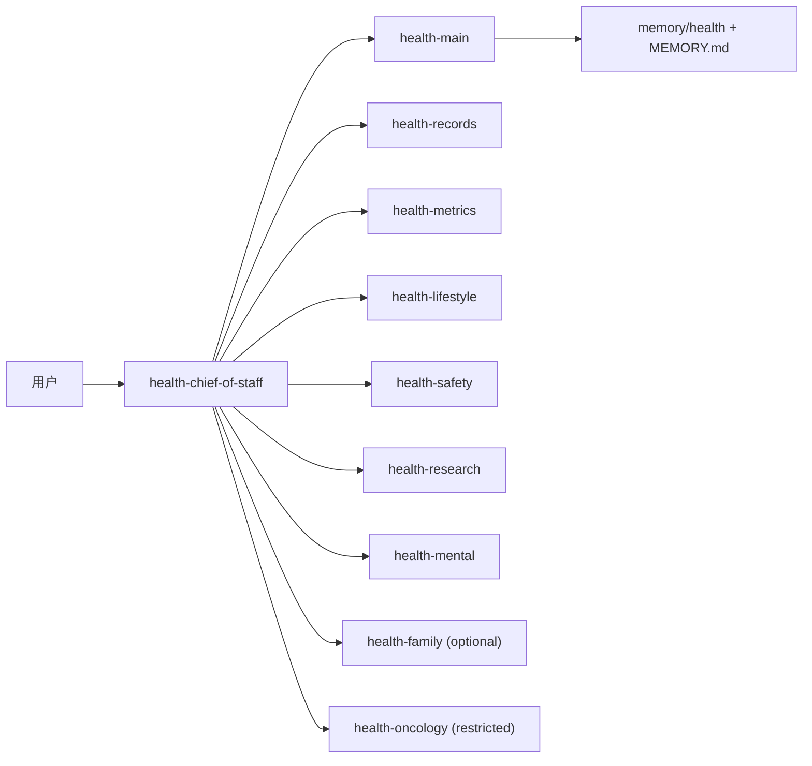

# VitaClaw Health Team Architecture

这份文档描述 VitaClaw Iteration 3 推荐的 chief-led 多 agent 架构。

## 1. 核心心智模型

用户只需要和 `health-chief-of-staff` 对话。

它不是一个单独完成所有工作的机器人，而是一个总管：

- 接收用户请求和 heartbeat 事件
- 判断这是记录、复盘、病历、风险、研究还是照护问题
- 把任务分派给后台 specialist
- 汇总 brief、升级风险、安排下一步
- 把允许的长期事实写回交给 `health-main`

## 2. 默认角色分工

### `health-chief-of-staff`

- 唯一默认聊天入口
- 管路由、优先级、任务板、汇总、升级和持续跟进

### `health-main`

- 唯一长期稳定事实写入者
- 负责 `MEMORY.md`、`items/`、appointments、digests、distill

### `health-records`

- 管原始病历、体检报告、Apple Health 摘要、统一时间线
- 可写 archive summary 和 timeline
- 不直接改长期画像

### `health-metrics`

- 管血压、血糖、体重、睡眠、肾功能等指标趋势
- 负责阈值判断、改善停滞、复查 follow-up

### `health-lifestyle`

- 管饮食、运动、作息、执行障碍和行为计划
- 把“做不到”变成结构化 barrier，而不是只给鸡汤

### `health-safety`

- 管危急值、必须就医、异常升级和边界控制
- 只允许写 alert / task / brief

### `health-research`

- 管指南、文献、药物和证据整理
- 默认不读 `MEMORY.md`，不读 raw patient archive

### `health-mental`

- 支持型心理守门员
- 管睡眠-情绪联动、PHQ/GAD 周期追踪、危机分流
- 不做治疗化建议

### `health-family`

- `family-care` 包启用
- 面向家庭协作、陪诊、续药、照护交接

### `health-oncology`

- `oncology` 包启用
- 受限专科角色，适合肿瘤标志物、时间线、复查节奏和病历密集场景

## 3. 团队工件

chief-led 架构会在主 workspace 下自动形成团队产物：

- `memory/health/team/tasks/`
  后台角色任务单
- `memory/health/team/briefs/`
  specialist brief 与 chief summary
- `memory/health/team/team-board.md`
  用户可读的团队状态卡
- `memory/health/team/audit/dispatch-log.jsonl`
  分派、写回、升级审计

这层工件的目标是：用户能看见“背后像有团队在持续服务”，而不是只看到更多散文件。

## 4. 默认路由规则

- 高血压 / 糖尿病日常管理：chief -> metrics + lifestyle -> main
- 年度体检 / 报告导入：chief -> records + metrics -> main
- 危急值 / 必须就医：chief -> safety -> main
- 心理支持：chief -> mental；若出现危机则强制并入 safety
- 研究问题：chief -> research
- 家庭协作：chief -> family
- 肿瘤场景：chief -> oncology + research + safety

## 5. 隐私与隔离

- `health-main` 是唯一长期事实写入者
- `health-records` 可以读 raw archive，但不写长期画像
- `health-research` 默认不接触 `MEMORY.md` 和原始患者档案
- group / public 场景默认不加载长期健康记忆
- 公共 agent 默认不可读患者原始档案
- Iteration 3 仍不启用第三方通知或自动外发动作

## 6. 分层发行

VitaClaw Iteration 3 的分发按 4 层组织：

- `vitaclaw-core`
- `vitaclaw-family-care`
- `vitaclaw-oncology`
- `vitaclaw-labs`

对应说明见：

- [health-release-packages.zh.md](/Users/baozhiwei/Library/CloudStorage/坚果云-452858265@qq.com/我的坚果云/其他项目/vitaclaw-main/docs/health-release-packages.zh.md)
