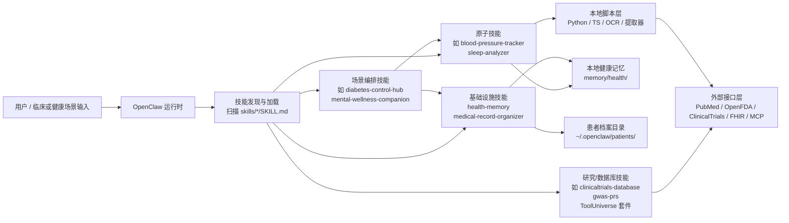
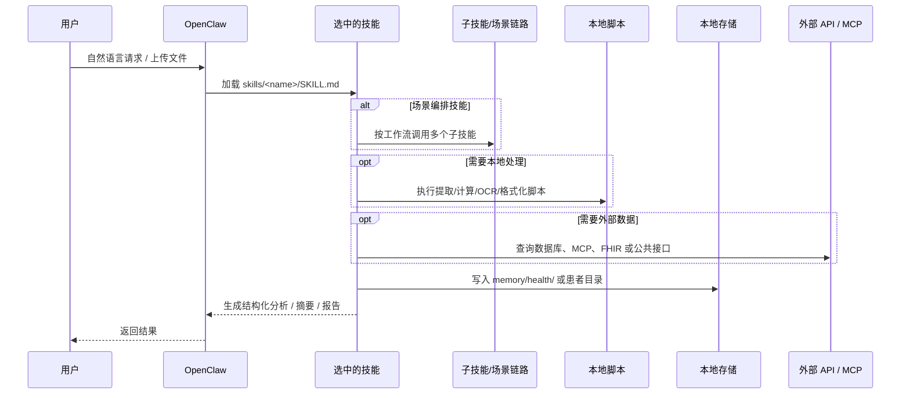

# VitaClaw 技术文档

> 文档基于当前仓库快照编写，分析时间为 2026-03-14。本文档关注仓库结构、运行机制、数据模型、依赖边界与扩展方式，而不是医学内容本身。

## 1. 项目定位

`VitaClaw` 不是传统意义上的单体应用、前后端服务或 SDK，而是一个面向 `OpenClaw` 运行时的健康 AI 技能仓库。它的核心交付物是大量独立的技能包，每个技能包至少包含一个 `SKILL.md`，由运行时扫描后加载为可调用能力。

从工程角度看，VitaClaw 可以理解为一个“以 Markdown 提示契约为主、以脚本和外部 API 为辅”的模块化能力平台：

- 提示层：`SKILL.md` 定义技能名、用途、工具权限、工作流、输出格式、约束与安全边界。
- 工具层：部分技能附带 Python/TypeScript/脚本，用于计算、解析、OCR、数据提取或调用外部接口。
- 数据层：通过 `memory/health/` 和 `~/.openclaw/patients/` 两类本地目录承载健康记忆与患者档案。
- 集成层：通过 OpenClaw、本地文件系统、公共生物医学 API、FHIR 服务、MCP/ToolUniverse 工具完成执行。

## 2. 当前仓库快照

### 2.1 盘点结果

| 指标 | 数值 | 说明 |
|------|------|------|
| 技能目录总数 | 225 | 以 `skills/*/SKILL.md` 统计 |
| README 标称技能数 | 225 | 来自根目录 `README.md` / `README.zh.md` |
| README 链接到的技能数 | 225 | 基于根 README 的技能链接解析 |
| 含 README 的技能包 | 47 | `README.md` 或 `README.zh.md` |
| 含 Python 文件的技能包 | 102 | 包含 `.py` 文件 |
| 含任意代码文件的技能包 | 117 | 含 `.py/.ts/.mjs/.R/.json` 等 |
| 含 `requirements.txt` 的技能包 | 25 | 采用技能级依赖隔离 |
| 含 `scripts/` 目录的技能包 | 43 | 额外脚本工具 |
| 含 `references/` 目录的技能包 | 46 | 参考资料/知识库 |
| 含 `assets/` 目录的技能包 | 10 | 模板、检查表、分类法等 |
| 含嵌入式 `repo/` 的技能包 | 1 | `trialgpt-matching/repo` |
| 显式 `user-invocable: true` | 42 | 明确标注为直接入口技能 |
| 显式 `user-invocable: false` | 37 | 明确标注为内部/基础设施技能 |
| 未显式声明 `user-invocable` | 161 | 依赖运行时默认行为或元数据解释 |

### 2.2 关键观察

- 顶层 README 的技能数量已经与仓库实际数量对齐。
- README 已经覆盖全部技能目录链接，不再遗漏 `apple-health-digest`、`health-timeline` 这类目录。
- 根目录没有统一的 `package.json`、`pyproject.toml`、`Dockerfile`、`Makefile` 或锁文件，说明仓库不是统一构建产物，而是“技能内容集合”。

## 3. 顶层目录结构

```text
vitaclaw-main/
├── README.md
├── README.zh.md
├── docs/
│   └── vitaclaw-technical-documentation.md
└── skills/
    ├── health-memory/
    ├── medical-record-organizer/
    ├── diabetes-control-hub/
    ├── blood-pressure-tracker/
    ├── clinical-reports/
    ├── tooluniverse-gwas-trait-to-gene/
    ├── trialgpt-matching/
    └── ... 200+ skill directories
```

工程上，`skills/` 是绝对核心目录。根目录 README 只负责说明、分类与安装入口，不承载运行逻辑。

## 4. 总体架构

### 4.1 逻辑架构图



### 4.2 执行时序图



## 5. 技能包组织模型

### 5.1 通用技能目录形态

```text
skills/<skill-name>/
├── SKILL.md                  # 必选，技能主定义
├── README.md / README.zh.md  # 可选，补充说明
├── requirements.txt          # 可选，技能级依赖
├── scripts/                  # 可选，本地辅助脚本
├── references/               # 可选，参考文档
├── assets/                   # 可选，模板/检查表/分类法
├── examples/ / tests/        # 可选，示例与测试
└── *.py / *.ts / *.mjs       # 可选，入口脚本或库文件
```

### 5.2 `SKILL.md` 的角色

`SKILL.md` 是 VitaClaw 的事实入口。仓库没有统一的运行主程序，但每个技能都以 `SKILL.md` 提供以下信息：

- 基本元数据：`name`、`description`、`version`
- 调用属性：`user-invocable`、`argument-hint`
- 运行权限：`allowed-tools`
- 平台元信息：`metadata.openclaw.emoji/category/requires/install`
- 执行方法：工作流、步骤、子技能链路
- 输入输出契约：输入格式、输出模板、字段说明
- 约束与安全：医疗免责声明、危机干预规则、禁止行为、隐私要求

这意味着 VitaClaw 本质上是“Prompt Contract Repository”，不是传统框架代码库。

### 5.3 技能类型分层

| 类型 | 代表技能 | 工程特征 |
|------|----------|----------|
| 基础设施技能 | `health-memory`、`medical-record-organizer` | 定义数据格式、目录规范、归档规则 |
| 场景编排技能 | `diabetes-control-hub`、`mental-wellness-companion` | 通过工作流串联多个子技能 |
| 原子追踪技能 | `blood-pressure-tracker`、`caffeine-tracker` | 聚焦单项指标记录、分析、预警 |
| 分析/报告技能 | `health-trend-analyzer`、`clinical-reports` | 生成结构化报告、模板、校验结果 |
| 研究数据库技能 | `clinicaltrials-database`、`openalex-database`、`gwas-database` | 查询公共生物医学数据库 |
| 集成型工具技能 | `ehr-fhir-integration`、`tooluniverse-*` | 对接 FHIR、MCP、ToolUniverse、远端服务 |
| 文档处理技能 | `markitdown`、`pdf-processing-pro` | 做文档解析、格式转换、OCR 与模板化 |

## 6. 数据架构

### 6.1 健康记忆层：`memory/health/`

`health-memory` 定义了跨技能共享的数据契约。它是整个健康追踪体系的统一读写层。

```text
memory/health/
├── _health-profile.md
├── daily/
│   └── YYYY-MM-DD.md
├── items/
│   ├── blood-pressure.md
│   ├── blood-sugar.md
│   ├── kidney-function.md
│   └── ...
└── files/
    └── YYYY-MM-DD_<description>.<ext>
```

#### 设计原则

- 每日日志聚合：同一天只保留一个 daily 文件。
- 分项纵向追踪：每个健康主题有自己的 item 文件。
- 文档摘要入库：PDF/图片原件保存在 `files/`，memory 只保留摘要与索引。
- 格式一致：不同技能可以通过共享 Markdown 结构互操作。

#### daily 文件约定

- 文件路径：`memory/health/daily/YYYY-MM-DD.md`
- 每个技能写一个 section：`## 标题 [skill-name · HH:MM]`
- `## 健康文件` 固定在文件末尾
- 同一技能当日多次写入时应覆盖 section，而不是重复追加

#### item 文件约定

- 文件路径：`memory/health/items/{item}.md`
- 通过 `## 最近状态` + `## 历史记录` 表达快照与趋势
- 历史记录通常保留最近 90 天

### 6.2 患者档案层：`~/.openclaw/patients/`

`medical-record-organizer` 负责把 PDF、扫描件、图片、Excel、Word 报告归档到匿名化患者目录。

其初始化脚本 `skills/medical-record-organizer/scripts/init_patient.py` 创建的典型结构如下：

```text
~/.openclaw/patients/<PATIENT_ID>/
├── INDEX.md
├── timeline.md
├── profile.json
├── 01_当前状态/
│   ├── 当前状态.md
│   └── 历史快照/
├── 02_诊断与分期/病理报告/
├── 03_分子病理/
│   ├── 基因检测/
│   └── 免疫组化/
├── 04_影像学/
│   ├── CT/
│   ├── MRI/
│   ├── PET-CT/
│   ├── 超声/
│   └── X光DR/
├── 05_检验检查/
│   ├── 血常规/
│   ├── 生化肝肾功/
│   └── 肿瘤标志物/
├── 06_治疗决策历史/
├── 07_合并症与用药/
├── 08_出院小结/
│   └── 入院小结/
├── 09_Apple_Health/
├── 10_原始文件/
│   ├── 未分类/
│   ├── 门诊记录/
│   └── 原始未遮挡/
└── 11_诊断证明/
```

#### 关键特征

- 默认隐私模式开启，目录与索引优先使用匿名患者 ID。
- 附带 `INDEX.md`、`timeline.md`、`profile.json`、`治疗决策总表.md`、`肿标趋势.md` 等辅助索引文件。
- 分类依据来源于 `assets/document-taxonomy.md`，但技能明确要求分类动作由 Agent 理解文档后完成，不允许用关键词脚本替代。

## 7. 运行机制

### 7.1 加载方式

根据根 README，项目安装方式是直接 clone 或按目录复制到 OpenClaw 技能目录。也就是说：

- 无统一构建步骤
- 无全局安装器
- 无单一服务进程
- 运行时通过目录扫描发现技能

### 7.2 执行模型

VitaClaw 的执行模型可以概括为四类：

1. 纯指令型技能
   `health-memory` 为代表，不依赖脚本，只通过 Agent 的读写工具操作文件。

2. 提示编排型技能
   `diabetes-control-hub`、`mental-wellness-companion` 等通过表格和步骤定义调用链，真正的“编排器”是运行时 Agent，而不是代码框架。

3. 脚本增强型技能
   `blood-pressure-tracker`、`kidney-function-tracker`、`checkup-report-interpreter` 等附带 Python 文件，执行计算、图表、解析或统计。

4. 外部接口型技能
   `medical-research-toolkit`、`tooluniverse-*`、`ehr-fhir-integration` 等直接面向 MCP、FHIR、公共 REST API 或远端服务。

### 7.3 工具权限模型

已观察到的 `allowed-tools` 形式包括：

- `Read, Grep, Glob, Write, Edit`
- `Read, Write, Edit, Bash`
- 更复杂的 `WebFetch`、`WebSearch`、`NotebookEdit`、MCP 工具集合

说明该仓库并不采用统一工具沙箱，而是按技能粒度声明运行权限。

## 8. 技术栈与依赖模型

### 8.1 语言与实现方式

| 层级 | 主要形式 |
|------|----------|
| 定义层 | Markdown + YAML frontmatter |
| 脚本层 | Python 为主，少量 TypeScript / JavaScript / R |
| 数据层 | Markdown、JSON、CSV、PDF、图片 |
| 接口层 | REST API、FHIR、MCP、ToolUniverse |

### 8.2 依赖组织方式

依赖不是在根目录集中管理，而是技能级管理。已观察到的常见依赖包括：

- `requests`
- `matplotlib`
- `openai`
- `pandas`
- `numpy`
- `torch`
- `transformers`
- `sentence_transformers`
- `faiss` / `faiss_cpu`

这说明仓库具备多种能力形态：

- 轻量脚本型：只做 HTTP 请求、规则计算、文件读写
- 分析型：依赖 `numpy/pandas/matplotlib`
- NLP/检索型：依赖 `transformers/faiss/langchain`
- OCR/文档处理型：在技能元数据中声明 `paddleocr`、`paddlenlp`、`pdfplumber` 等

### 8.3 共享代码与复用

虽然设计上强调“技能独立”，但实现上仍有复用痕迹：

- 某些脚本通过 `sys.path` 注入方式引用共享模块，例如多个追踪技能尝试导入 `../_shared/health_data_store.py`
- 部分技能暴露 `api.py` 以供其他技能程序化复用，例如 `gwas-prs/api.py`
- 部分技能提供 `coworker.py`，模拟 Anthropic/Claude 风格的结构化协作逻辑

这说明项目正处于“提示为主、局部代码平台化”的混合状态。

## 9. 外部接口与集成面

### 9.1 OpenClaw

这是 VitaClaw 的首要宿主环境。项目通过把技能目录放入 OpenClaw 可扫描路径实现接入。

### 9.2 本地文件系统

本地文件系统是最核心的数据总线：

- `memory/health/` 承载健康记忆
- `~/.openclaw/patients/` 承载患者档案
- 上传文件、日志、趋势表、索引文件均通过本地文件系统串联

### 9.3 公共医学数据库与 API

仓库内容中大量出现以下数据源或接口：

- PubMed / NCBI E-utilities
- ClinicalTrials.gov
- OpenFDA
- GWAS Catalog
- Open Targets
- UniProt
- KEGG
- Reactome
- Ensembl
- gnomAD
- OpenAlex

### 9.4 FHIR / EHR

`ehr-fhir-integration` 提供了基于 `fhirpy` 与 `fhir.resources` 的 FHIR 客户端能力，说明项目可向医院/机构电子病历系统扩展。

### 9.5 MCP / ToolUniverse

多个 `tooluniverse-*` 技能以及 `medical-research-toolkit` 体现了另一类架构思路：技能本身不实现数据库，而是作为统一外部工具的操作封装和工作流说明层。

## 10. 分类体系

根 README 采用 20 个一级分类来组织技能生态。按文档定义的公开分类如下：

| 分类 | README 数量 |
|------|-------------|
| 健康记忆与基础设施 | 2 |
| 场景应用 | 7 |
| 每日健康追踪 | 13 |
| 心理健康与危机干预 | 12 |
| 慢性病与治疗管理 | 10 |
| 生物医学数据库 | 23 |
| 药理学与药物安全 | 9 |
| 临床研究与试验 | 7 |
| 基因组学与变异解读 | 14 |
| 药物基因组学 | 4 |
| 肿瘤学与精准医疗 | 13 |
| 血液学与血液疾病 | 8 |
| 免疫信息学 | 4 |
| 液体活检与 ctDNA | 8 |
| ToolUniverse 套件 | 27 |
| 医学 NLP 与报告 | 13 |
| 科研与文献 | 11 |
| 数据科学与可视化 | 4 |
| 综合健康与生活方式 | 11 |
| 工具与文档处理 | 5 |

需要注意，这套分类是文档层公开分组，不等同于当前仓库磁盘快照的精确数量统计。

## 11. 代表性模块剖析

### 11.1 `health-memory`

- 角色：统一健康数据契约
- 类型：纯指令型基础设施技能
- 特征：不依赖脚本，所有操作由 Agent 使用读写工具完成

### 11.2 `diabetes-control-hub`

- 角色：糖尿病管理场景编排器
- 类型：工作流型入口技能
- 特征：通过步骤表串联 `chronic-condition-monitor`、`nutrition-analyzer`、`fitness-analyzer`、`kidney-function-tracker`、`health-memory` 等子技能

### 11.3 `mental-wellness-companion`

- 角色：心理健康场景编排器
- 特征：把危机检测设为最高优先级，先做安全筛查，再执行 PHQ-9/GAD-7、睡眠、运动、行为激活与健康记忆更新

### 11.4 `medical-record-organizer`

- 角色：患者文档归档中台
- 特征：既有脚本辅助提取/OCR/解压，也通过技能文本强约束 Agent 按顺序执行，不允许“一键脚本化替代临床理解”

### 11.5 `clinical-reports`

- 角色：临床报告生产与校验工具包
- 特征：同时包含 `references/`、`assets/`、`scripts/`，属于知识库 + 模板库 + 校验脚本的复合型技能

### 11.6 `trialgpt-matching`

- 角色：临床试验匹配能力封装
- 特征：包含嵌入式 `repo/`，不是单纯技能文档，而是将外部项目一并纳入仓库

## 12. 安全、隐私与合规边界

### 12.1 明确优势

- 本地优先：健康记忆和患者档案主要落地于本地文件系统
- 可审计：Markdown、JSON、目录结构天然适合 git 管理和人工审阅
- 可去标识化：患者档案默认匿名 ID，`profile.json` 也默认 `REDACTED`
- 安全提示普遍存在：大量技能包含医疗免责声明、危机干预、临床边界说明

### 12.2 工程风险

- 外部接口依赖高：很多研究技能依赖第三方 API、MCP、数据库可用性和限流策略
- 依赖离散：每个技能自己带依赖，缺少统一环境锁定
- 目录约定强：如果运行环境不遵守 `memory/health/` 和 `~/.openclaw/patients/` 约定，很多技能无法互通

## 13. 已观察到的维护风险

### 13.1 文档与仓库漂移

- README 写的是 `204` 个技能
- README 链接统计为 `205`
- 磁盘中实际有 `207` 个 `SKILL.md`

说明发布文档与仓库内容不同步。

### 13.2 许可证不统一

顶层 README 使用 MIT 徽章，但仓库内部可以观察到多种许可证/版权状态：

- `MIT`
- `CC0-1.0`
- `Proprietary`
- `Non-Commercial`
- 多个文件带有 `All Rights Reserved` / `Unauthorized copying` 声明

因此，VitaClaw 不能简单视为“整体 MIT 项目”；如果要二次分发或商用，必须逐技能做许可证审计。

### 13.3 共享模块缺失迹象

多个追踪类脚本尝试导入 `skills/_shared/health_data_store.py`，但当前仓库快照中未见该目录。这意味着：

- 某些脚本可能依赖未提交的共享模块
- 或仓库曾做过拆分但未完全同步
- 对这些脚本的直接执行需额外验证

### 13.4 Frontmatter 规范不完全统一

已观察到的 `SKILL.md` frontmatter 风格包括：

- 标准 YAML 标量
- JSON 字符串嵌入到 `metadata`
- 完整 YAML 对象
- 带 `license`、`compatibility`、`keywords`
- 不含 `user-invocable` 的默认型技能

说明仓库缺少一份严格统一的技能 schema。

## 14. 适合的工程使用方式

### 14.1 作为技能仓库使用

这是当前最自然的用法：

- 将整个仓库挂载到 OpenClaw 技能目录
- 让运行时按需加载技能
- 用 `health-memory` 和 `medical-record-organizer` 作为数据底座

### 14.2 作为技能模板库/知识资产库使用

对于不直接运行 OpenClaw 的团队，也可以把它当作：

- 医学场景 Prompt 资产库
- 医疗文档模板库
- 医学数据库查询手册
- 本地患者档案结构参考实现

### 14.3 不适合作为单体服务直接部署

因为它缺少：

- 统一入口服务
- 全局依赖管理
- 统一 API 层
- 一致的测试与发布流程

若要产品化为服务，需要额外抽出：

- 技能 schema 与注册中心
- 脚本执行沙箱
- 数据存储抽象层
- 外部接口代理层
- 权限/审计/合规模块

## 15. 扩展建议

如果继续演进 VitaClaw，建议优先做以下工程化工作：

1. 补一份统一的 `SKILL.md` schema 文档与校验器。
2. 建立仓库级清单生成脚本，自动刷新 README 的技能数量与分类统计。
3. 把共享代码正式收敛到可见目录，例如 `skills/_shared/` 或 `lib/`。
4. 为脚本型技能建立最小可运行测试，至少覆盖导入和关键路径。
5. 做许可证清单，按技能输出 SPDX 或自定义 license manifest。
6. 抽离“数据契约层”文档，明确 `memory/health/`、患者目录、报告模板的标准字段。

## 16. 结论

VitaClaw 的本质是一个围绕 OpenClaw 构建的健康 AI 技能生态仓库。它不是单应用，而是由 200+ 技能包、两个本地数据平面、若干脚本工具、多个外部医学接口以及大量 prompt/workflow 文档共同组成的模块化系统。

其最强的工程特征有三点：

- 本地优先的数据组织方式
- 以 `SKILL.md` 为核心的提示契约架构
- 通过场景编排技能把原子能力串成临床/健康工作流

如果把它作为“可组合的健康 AI 运行资产库”来理解，当前仓库结构是清晰且有可扩展性的；如果把它当成“可直接部署的一体化应用”，则还缺少统一入口、统一依赖、统一 schema 和一致的合规清单。
